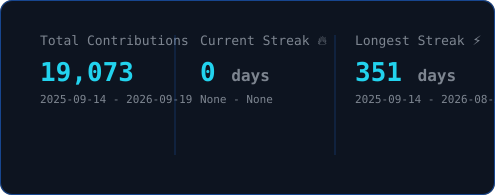

<h3><code>Rajeev91691@github ~ $ ./contributions.sh</code></h3>

  

<h3><code>Rajeev91691@github ~ $ whoami</code></h3>
<table>
  <tr>
    <td valign="top"></td>
    <td valign="top"></td>
  </tr>
</table>

 

<!-- Social Badges -->

  

---

## 🏆 GitHub Trophies

  

---

## 💻 Tech Stack

### 🔤 Languages

### 🤖 AI / ML & Research

### 🌐 Full-Stack & Web

### 🗄️ Databases & DevTools

---

## 🚀 Featured Projects

### 🤖 Generative AI & Machine Learning

| Project | Description | Stack | Links |
|---------|-------------|-------|-------|
| [genai-assistant](https://github.com/Rajeev91691/genai-assistant) | Domain-specific RAG pipeline over 500+ PDFs — 0.82 retrieval accuracy, sub-second latency | Python · FAISS · LangChain · Gradio | [🤗 Demo](https://huggingface.co/spaces/Rajeev91691/genai-assistant) |
| [image-gen-app](https://github.com/Rajeev91691/image-gen-app) | Text-to-image diffusion pipeline generating 512×512px images — CLIP score 0.78 | PyTorch · DDPM · Gradio | [🤗 Demo](https://huggingface.co/spaces/Rajeev91691/image-gen) |
| [object-detector](https://github.com/Rajeev91691/object-detector) | Real-time in-browser object detection at 15 FPS via DETR-ResNet-50 — mAP@0.5 = 0.68 | Python · DETR · HuggingFace | [🤗 Demo](https://huggingface.co/spaces/Rajeev91691/Object-Detection) |
| [emotion-detector](https://github.com/Rajeev91691/emotion-detector) | Real-time 7-class facial emotion recognition from live webcam feed | TensorFlow · OpenCV · Python | — |
| [BankMarketing-CaseStudy](https://github.com/Rajeev91691/BankMarketing-CaseStudy) | End-to-end ML case study — EDA, feature engineering, XGBoost benchmarking | Jupyter · Pandas · Scikit-learn | — |

### 🌐 Full-Stack & Web Experiences

| Project | Description | Stack | Links |
|---------|-------------|-------|-------|
| [rajeev-portfolio](https://github.com/Rajeev91691/rajeev-portfolio) | Cinematic dev portfolio — scroll-scrubbed 1080p hero, custom cursor, AI RAG terminal | Next.js 15 · GSAP · Framer Motion · Three.js | [🌍 Visit](https://rajeevnandan.rweb.site) |
| [3d-professional-portfolio](https://github.com/Rajeev91691/3d-professional-portfolio) | Immersive 3D scroll-driven portfolio with React Three Fiber scenes | TypeScript · Three.js · React Three Fiber | — |

---

## 📊 GitHub Analytics

  
  

  

  

### 🐍 Contribution Snake

  <picture>
    <source media="(prefers-color-scheme: dark)" srcset="https://raw.githubusercontent.com/Rajeev91691/Rajeev91691/output/github-snake-dark.svg">
    <source media="(prefers-color-scheme: light)" srcset="https://raw.githubusercontent.com/Rajeev91691/Rajeev91691/output/github-snake.svg">
    
  </picture>

---

## 📜 Certifications

---

## 🤝 Let's Connect

---

### 💬 Random Dev Quote

---

  <i>"Building at the intersection of AI, design, and engineering. 🚀"</i>
    
  

<!-- Last updated: 2026-07-30T23:45:00+05:30 -->
